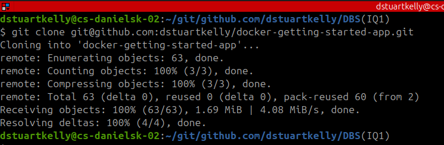
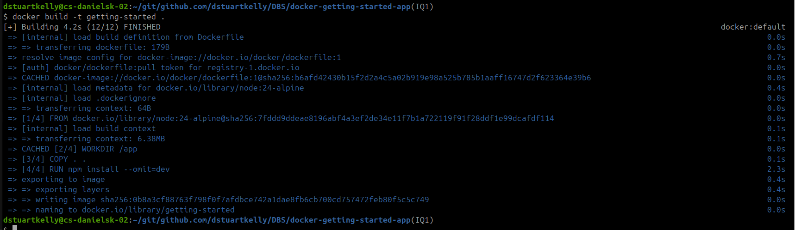
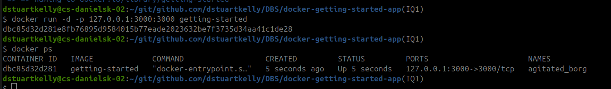
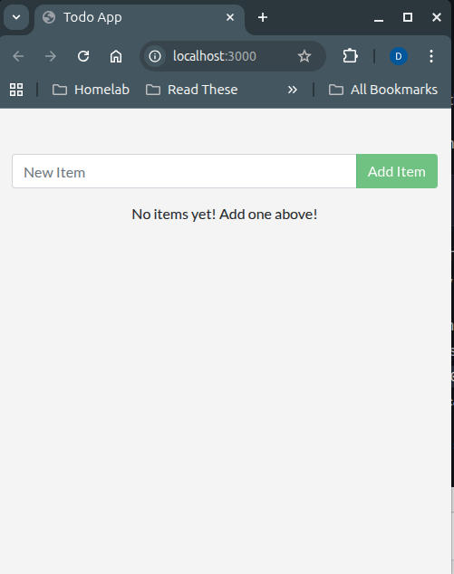

# Part 1
## Prerequisites
- Have the [latest version of docker installed](https://docs.docker.com/engine/install/ubuntu/)
- Have a [git client installed](https://git-scm.com/install/linux)
- Have an IDE or text editor [Visual Studio Code Suggested](https://code.visualstudio.com/download)

## Get the App
1. For the purpose of the assignment I have "forked" the repository indicated
- Docker advise cloning https://github.com/docker/getting-started-app 
- To remove the risk of any changes being made in the source repo, I have forked it. The forked repo can be found at https://github.com/dstuartkelly/docker-getting-started-app
```bash
git clone git@github.com:dstuartkelly/docker-getting-started-app.git
```


## Build the Apps Image
 Included [Dockerfile](./Dockerfile) is provided by Docker workshop. This file should be placed in the root directory of the repo we cloned during the *Get the App* step. We build the image using the command ```docker build -t getting-started .```

 

## Start an app container
We then run the app with the command 
```docker run -d -p 127.0.0.1:3000:3000 getting-started```




## Summary
In this section we cloned a repo and created a [Dockerfile](./Dockerfile) to build an image.
We used this image to start a container and saw the app running.