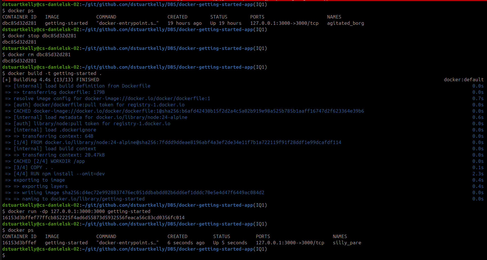
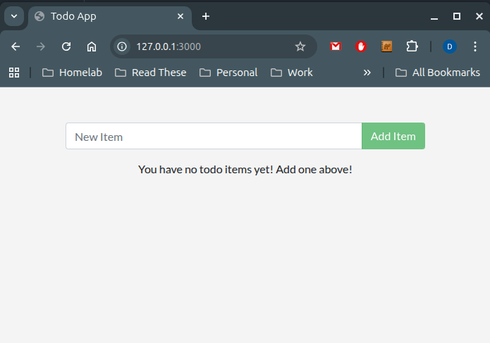

# Part 2 Update the Application

From: https://docs.docker.com/get-started/workshop/03_updating_app/

## Update the source code

In the [getting-started-app I forked earlier](https://github.com/dstuartkelly/docker-getting-started-app), I edit the src/static/js/app.js

```
- <p className="text-center">No items yet! Add one above!</p>
+ <p className="text-center">You have no todo items yet! Add one above!</p>
```

I then [commited](https://github.com/dstuartkelly/docker-getting-started-app/commit/20ccff3bdcf80806c14306aeaefc06039d905b08) the edit to the forked repo.

## Remove the old container, build then run the new image.
The image can be rebuilt immediately, however the updated container cannot be started while the existing container is still running. So the steps are
1. Find the container ID of the running container with ``docker ps`` command
2. Stop the container using ``docker stop container id``
3. Remove the old container using ``docker rm container id``
4. Build the new container using ``docker build -t getting-started .``
5. Start the new & updated container (this container is loaded from the locally available docker images).



Check the browser on http://localhost:3000 and I now see the updated text.


## Summary
In this section I updated and rebuilt the image.
Before running the new image, I had to stop and remove the old container.

[Continue to Part 3](./Part3.md)