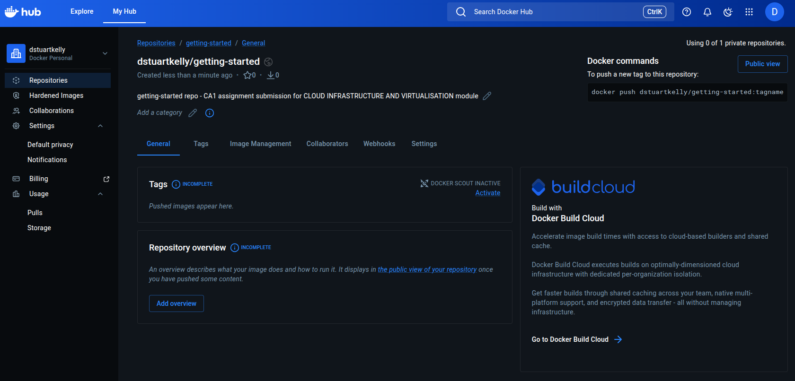
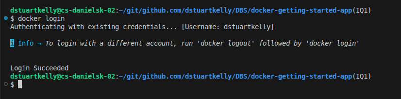
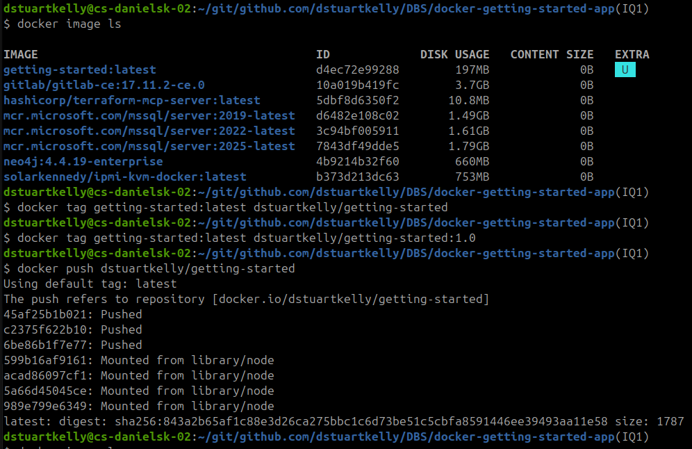
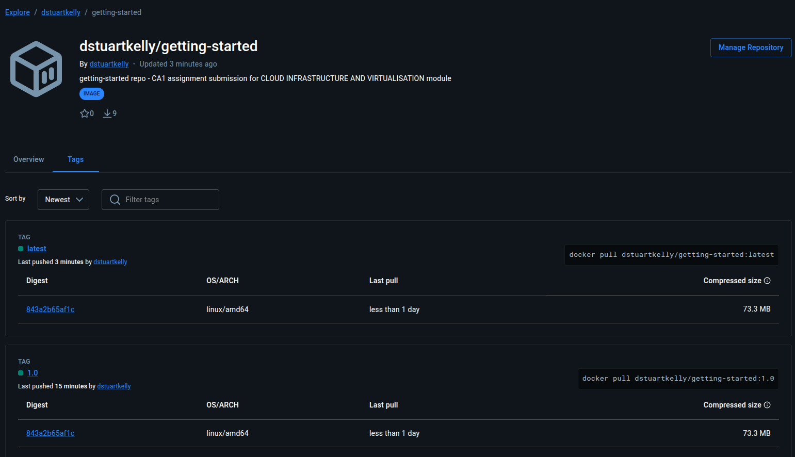

# Part 3 Share the Application

## Create a repository
We are creating a new repository in docker hub called ``getting-started``. This is done by signing up and logging into [docker hub](https://hub.docker.com/), navigating to My Hub -> Repositories

1. Click on create a repository
2. Give it a name and a description (the name must be unique among your existing repositories)
3. Select if you want it to be Public (accessible to everyone on the internet) or private
4. Click create

## Push the image

### Log Into Docker Hub
We should make sure that we are logged into docker hub using the ``docker login`` command and following the instructions on-screen

### Image tagging
We then need to tag the local image appropriately so that it can be uploaded to the repo we have created. It is good practice to give it a version.  

The command syntax for tagging an image is:  
``docker tag ExistingImage Username/RepoName:Version``  

Because we want to upload this to my repo the command to tag the image will be  
``docker tag getting-started dstuartkelly/getting-started``  
If we do not include the version when tagging, then by default the image will receive the tag ``latest``  

### Pushing the Image
The command we will use to upload (push) the image needs to be run once for every tag we want to make available from docker hub.  
``docker push dstuartkelly/getting-started`` will upload the image with the default ``latest`` tag.   

  

### Additional tags
In the below example provides the commands to tag the same image with 1.0 to indicate the version and pushing it to docker hub.  
``docker tag getting-started dstuartkelly/getting-started:1.0``  
``docker push dstuartkelly/getting-started:1.0``  will upload the image with the ``1.0`` tag

The screenshot here shows us two tags available, you should note that these tags have the same hash, which indicatest that they are the same image with the same contents.

This will allow us to pull the image without specifying the version.
``docker pull dstuartkelly/getting-started``

## Run the image on a new instance

Now that the image has been built and pushed to docker hub (and the docker hub repo is public) this image can be pulled and run on any machine that has docker installed and has access to docker hub. 

Pull the image with tag 1.0  
``docker pull dstuartkelly/getting-started:1.0``
Pull the image with tag latest
``docker pull dstuartkelly/getting-started:latest``
Pull the default image (image with latest tag)
``docker pull dstuartkelly/getting-started``

## Summary
In part 3 we have shown how to tag and share images on docker hub.

[Continue to Part 4](./Part4.md)