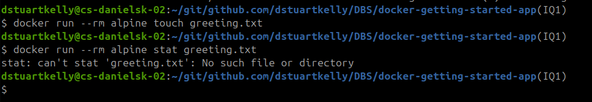
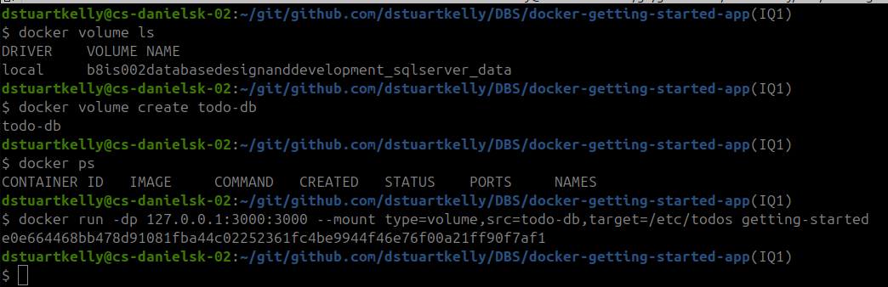
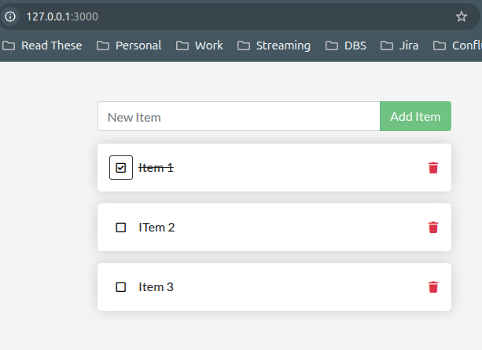
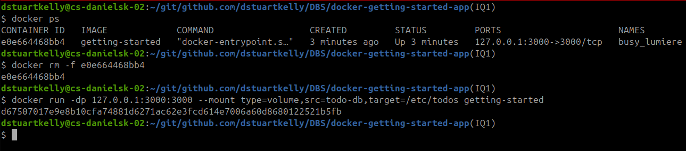
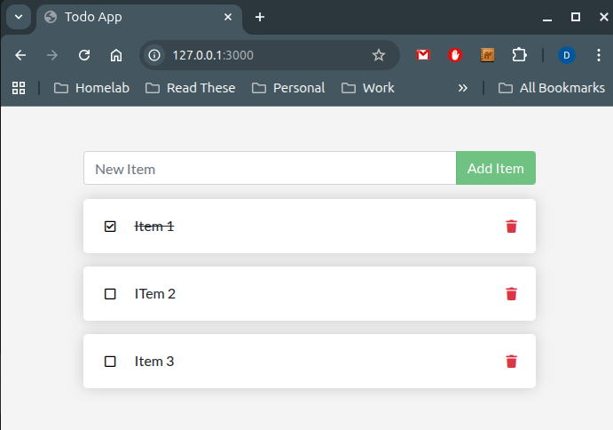
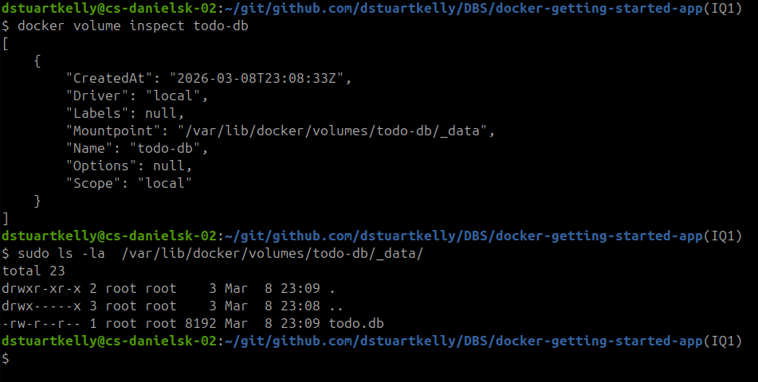

# Part 4 Persist the Database

## Container filesystem in practice

In this example we run the alpine base image using the ``--rm`` flag which instructs docker to remove the container and associated volumes when it exits.  

  

The first time we run it we pass the command ``touch greeting.txt`` to the container which creates the file greeting.txt and exits the container (and deletes it because of the --rm flag).

The second time we run it we pass the command ``stat greeting.txt`` which displays files or file system status if the file exists. When we run the command here, we get a *No such file or directory* message because the changes made in the first container did not persist to the second.

Containers start from their image definition each time they start. All changes are lost when the container is stopped & removed.

## Create a volume and start the container

Here we create a new volume for the to-do app and start it.  

We add a few items to the to-do list  

## Verify data persists
We get the container ID and then remove it and restart it, this is functionally the same thing we did with the alpine image earlier in this workshop.

However, because we persisted the data in a volume, and connected the new container to the volume, the data persisted between deleting and creating a new container.  

## Dive into the volume
When we use docker volume inspect, we can see where on the disk of the docker host that the directory is stored and browse the contents of the directory.

## Summary
Here we used docker volumes to persist data across containers.

[Continue to Part 5](./Part5.md)