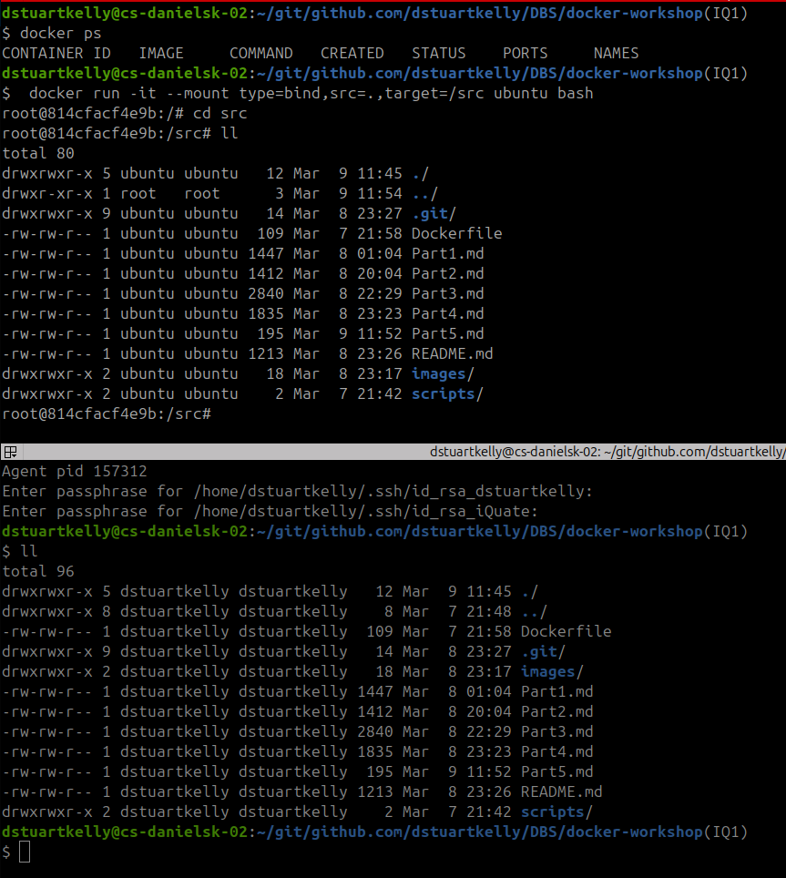
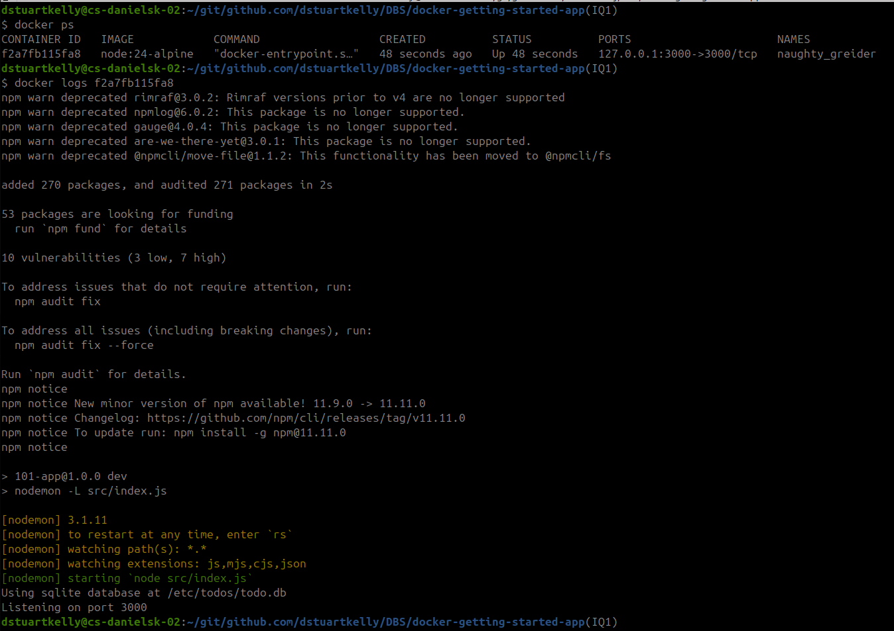
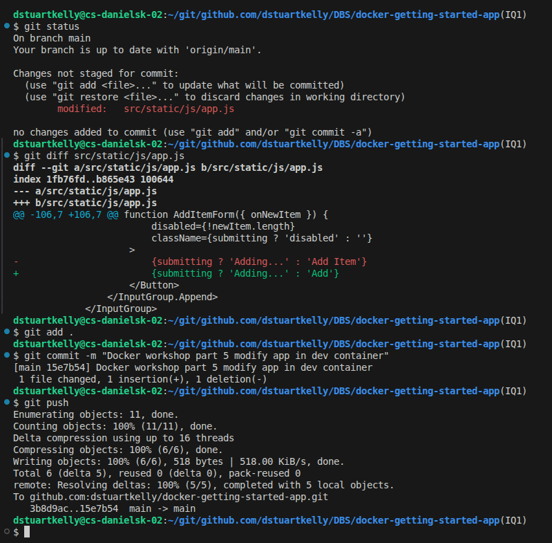
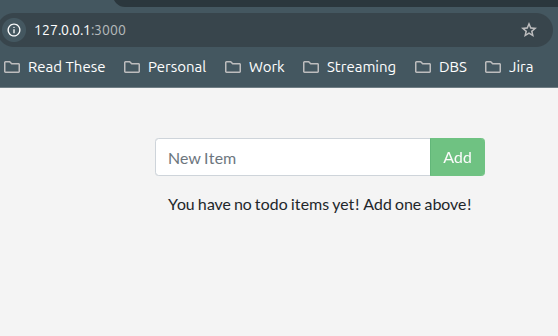
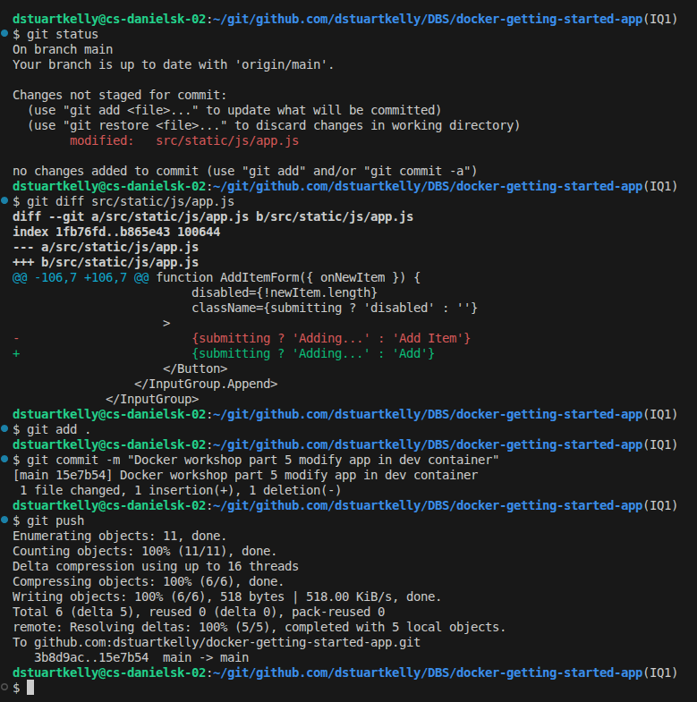
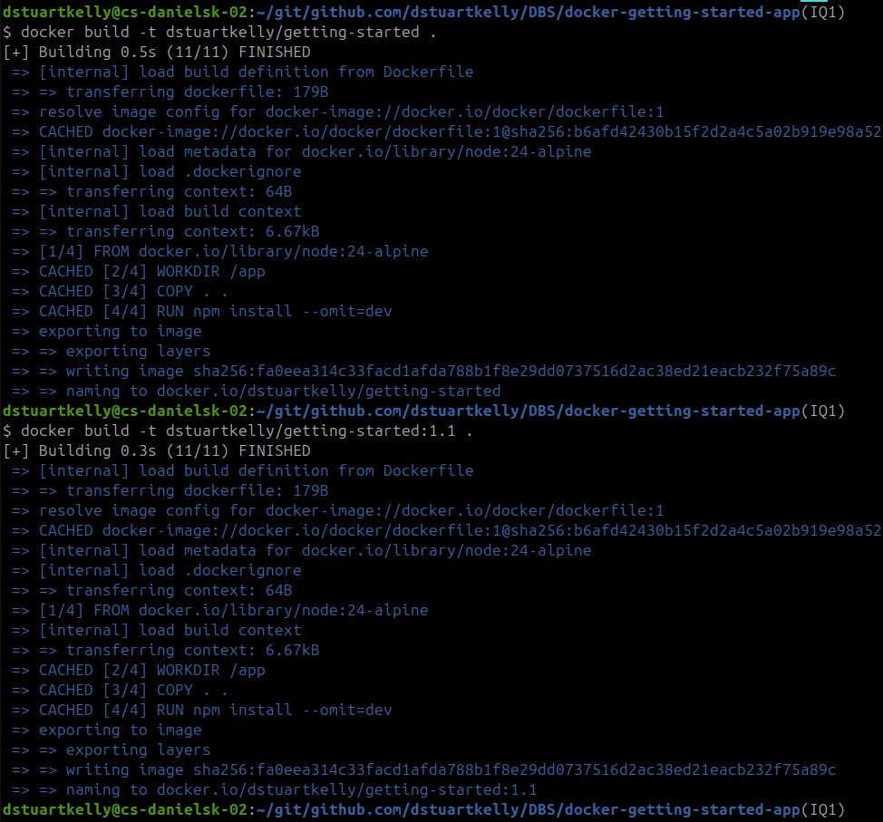
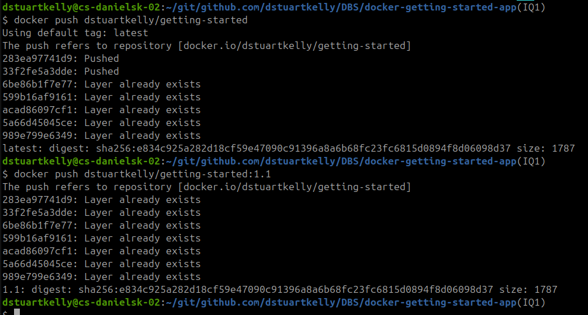
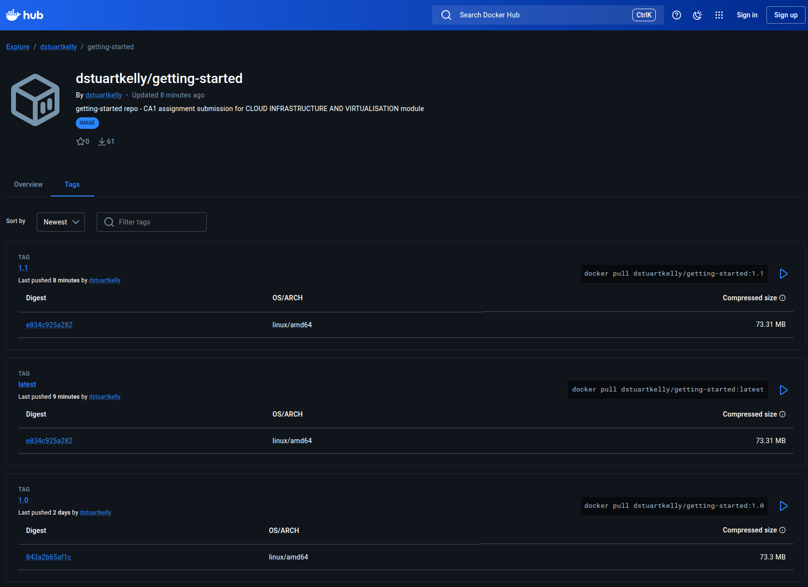

# Part 5 Use Bind Mounts

From: https://docs.docker.com/get-started/workshop/06_bind_mounts/

## Trying out Bind Mounts
Run the following to start bash in an ubuntu container with a bind mount. 

`` docker run -it --mount type=bind,src=.,target=/src ubuntu bash``

The below screenshot shows us 2 terminals.
1. In the top terminal I started the docker container mounting the local path (this repository) and navigate to the src directory. Note the path is ``root@814cfacf4e9b:/src`` and I displayed a list the files.
2. In the bottom terminal I am listing the files on my local machine in the repositories root directory.
3. Both terminals show the same file contents.   

## Development Containers

### Running the application in a development container

## Putting earlier steps together
At this stage, the changes validated in the development container are applied to the Docker image.

In the [docker-getting-started-app repository](https://github.com/dstuartkelly/docker-getting-started-app) I [committed and pushed](https://github.com/dstuartkelly/docker-getting-started-app/commit/15e7b5404b68c14b6bb1cb14e3f19ac41a046048) my changes.   

I built and tagged my docker image with the `latest` tag and a new `1.1` tag

Then I pushed the updated latest image and new 1.1 images to docker hub

The updated images can now be seen on the docker hub website and are available publically for anybody to pull and use.

## Summary
At this point, database data persists across containers and code changes are reflected in the running application without requiring an image rebuild.

In addition to volume mounts and bind mounts, Docker also supports other mount types and storage drivers for handling more complex and specialized use cases.

[Continue to Part 6](./Part6.md)