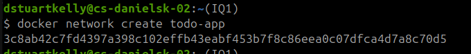
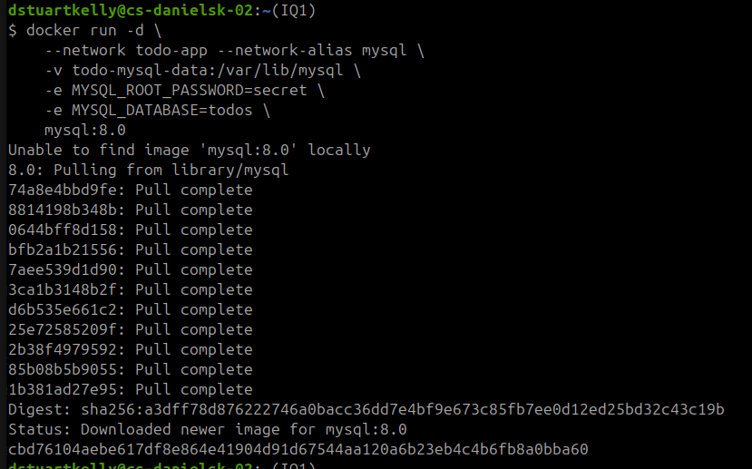
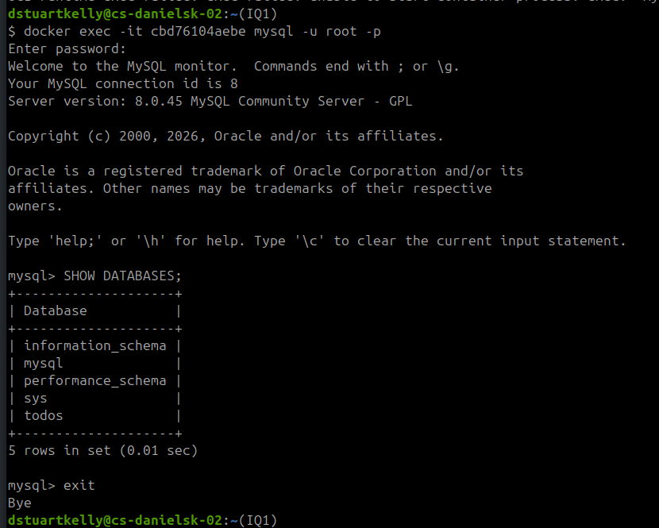
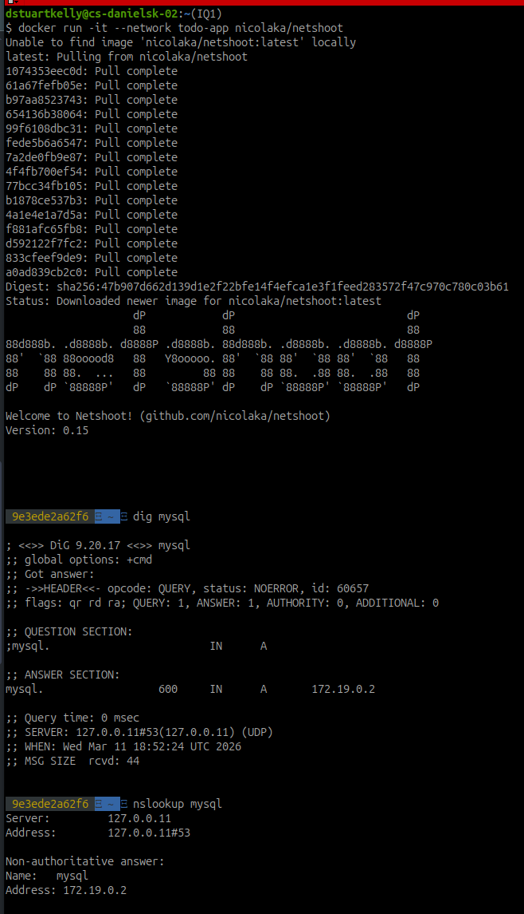
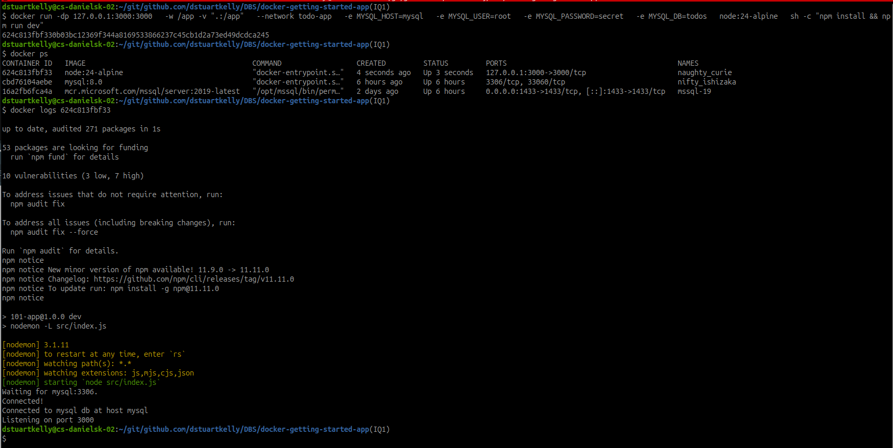
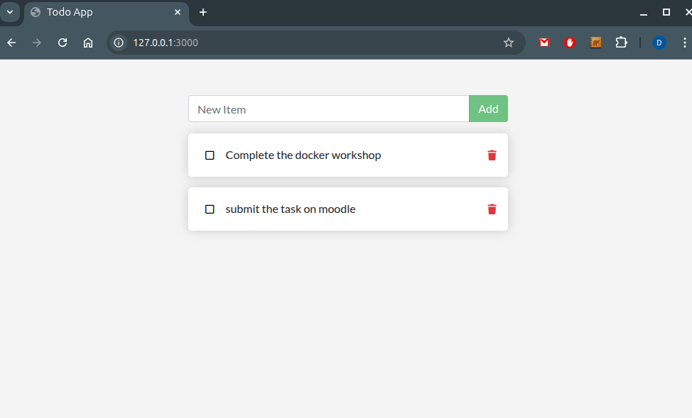
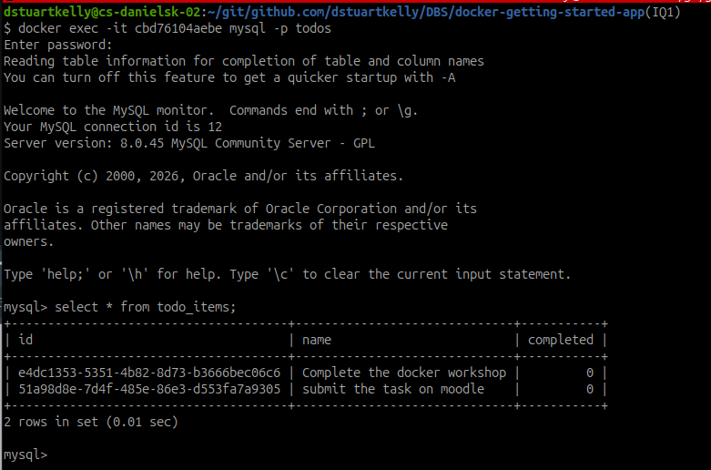

# Part 6 Multi Container Apps

From: https://docs.docker.com/get-started/workshop/07_multi_container/

## Start MySQL

Before starting the MySQL container, we are going to create a network for our todo-app
```bash
docker network create todo-app
```


We then run mysql:8.0 container and connect it to the newly created network. We also create a new docker volume called todo-mysql-data to persist the /var/lib/mysql data from the container.

```bash
docker run -d \
    --network todo-app --network-alias mysql \
    -v todo-mysql-data:/var/lib/mysql \
    -e MYSQL_ROOT_PASSWORD=secret \
    -e MYSQL_DATABASE=todos \
    mysql:8.0
```


## Connect to MySQL

We can test the database is up and running by opening an interactive terminal into the container using ``docker exec -it`` 



Using (netshoot docker network troubleshooting container)[https://hub.docker.com/r/nicolaka/netshoot] we can see the ``--network alias mysql`` used as part of our docker run command is available for other docker containers to use as a DNS hostname.




## Run the app with MySQL

Here we show the ``todo-app`` container starting and connecting to the MySQL database in the ``mysql`` container.



As this is a new databases, we add some tasks to the todo-app



And then we check directly in the database where we can see the tasks that were just added.



## Summary
In this part of the workshop, we created a docker-network and started a MySQL database container. We connected the todo-app container to the database running in the MySQL container and stored data in it. We also showed a little about network discovery using DNS tools ``dig`` and ``nslookup``.

[Continue to Part 7](./Part7.md)