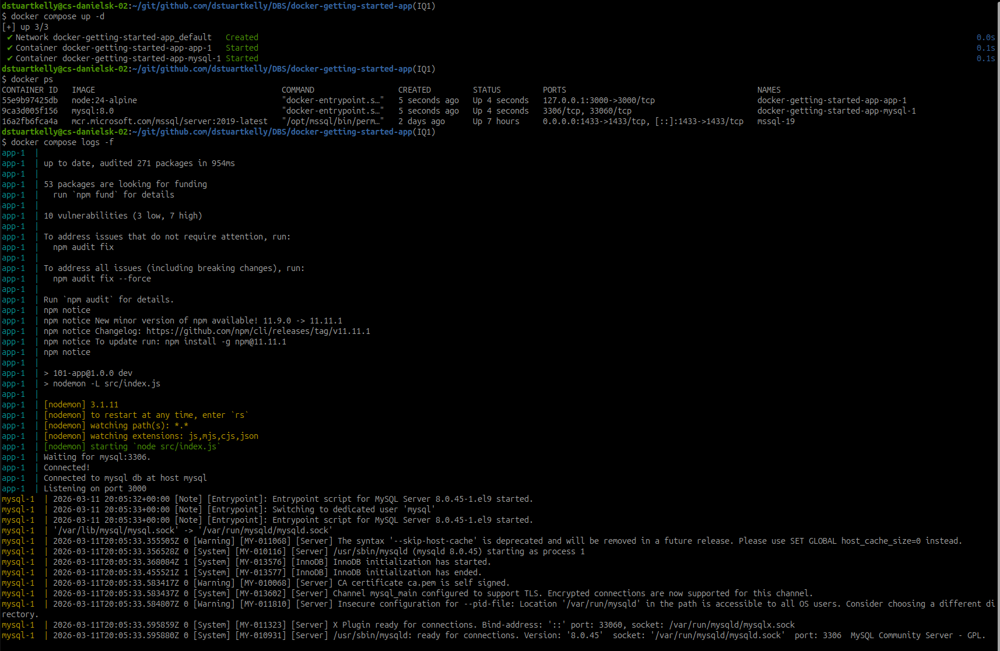
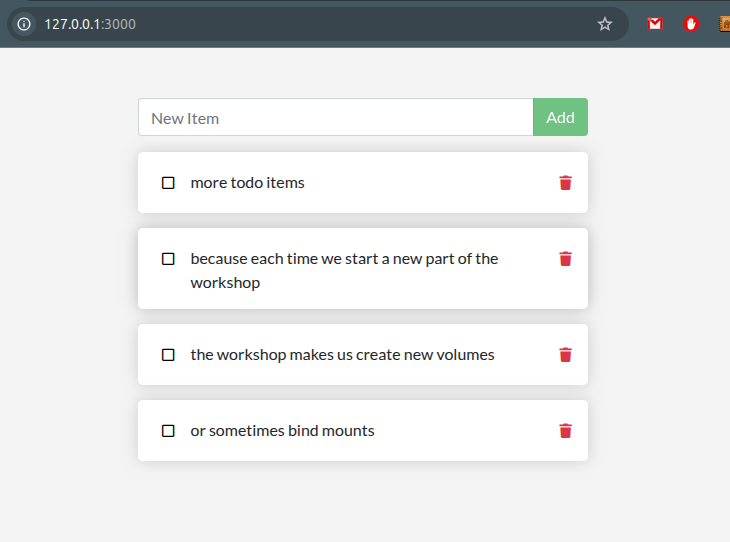

# Part 7 - Use Docker Compose

From: https://docs.docker.com/get-started/workshop/08_using_compose/

## Create the Compose file

```bash
touch compose.yaml
```

## Define the app service
```yaml
service:
  app:
    image: node:24-alpine
    command: sh -c "npm install && npm run dev"
    ports:
      - 127.0.0.1:3000:3000
    working_dir: /app
    volumes:
      - ./:/app
    environment:
      MYSQL_HOST: mysql
      MYSQL_USER: root
      MYSQL_PASSWORD: secret
      MYSQL_DB: todos
```

## Define the MySQL service
```yaml
  mysql:
    image: mysql:8.0
    volumes:
      - todo-mysql-data:/var/lib/mysql
    environment:
      MYSQL_ROOT_PASSWORD: secret
      MYSQL_DATABASE: todos
```
## Define the volume

```yaml
volumes:
  todo-mysql-data:

```

## Run the application stack





## Summary

We created a ``compose.yaml`` and used ``docker compose`` to configure and run two docker containers


**End of Exercise**